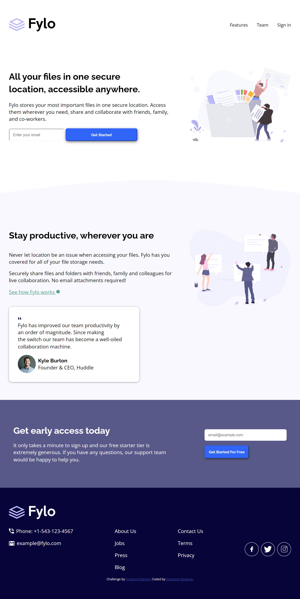

# Frontend Mentor - Fylo Landing Page with Two-Column Layout

## Screenshots

## Welcome! 👋

Thank you for exploring this front-end coding challenge.

Frontend Mentor challenges offer an opportunity to enhance your skills within a real-life workflow.

## Table of Contents

- [Screenshots](#screenshots)
- [The Challenge](#the-challenge)
- [Links](#links)
- [Built With](#built-with)
- [What I Learned](#what-i-learned)

**To take on this challenge, a basic understanding of HTML, CSS, and media queries is required.**

## The Challenge

Your task involves building this landing page to closely resemble the provided design.

Users should be able to:

- View the optimal layout for the site based on their device's screen size
- Observe hover states for all interactive elements on the page

## Links

- [Solution URL](https://www.frontendmentor.io/solutions/responsive-landing-page-using-flexbox--yr8v2lcG9)
- [Live site URL](https://godstimenwabue.github.io/fylo-landing-page-with-two-column-layout-master/)

## Built With

- Semantic HTML5 markup
- CSS custom properties
- Flexbox

## What I Learned

I encountered difficulties while achieving a perfect fit for the background image in the "Stay Productive, Wherever You Are" section. Although I considered using the 'position' property, I initially avoided it in search of a better alternative. Eventually, I discovered a simple workaround on Stack Overflow. I added a div, even though it remained empty, and assigned a class to it before commencing the design process. What are your thoughts on this approach?

Managing social media images also posed a challenge, as I initially believed that I could manipulate them directly from the SVG code. This assumption turned out to be incorrect, and I had to embed them directly into the HTML code, utilizing the "fill" property to finalize the design.

If you encounter any issues, please don't hesitate to reach out to me at "nwabuegodstime@gmail.com".

**Enjoy the building process!** 🚀
